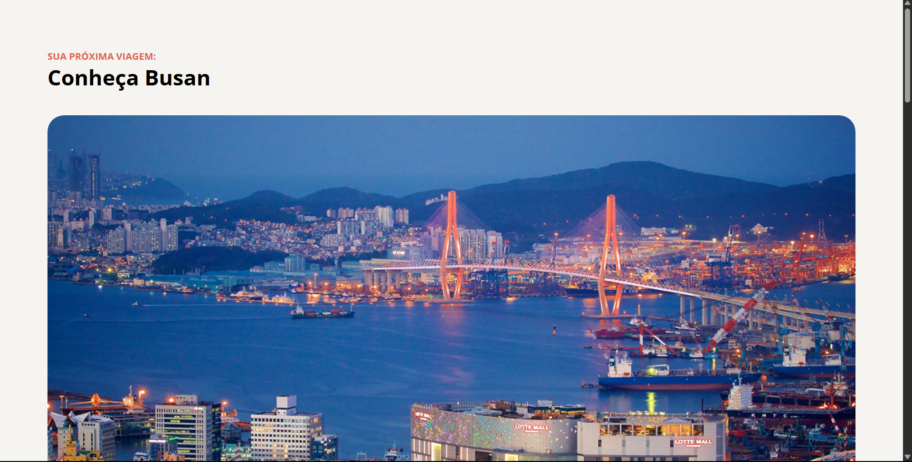

<!--  adicionar futuramente-->

# Conheça Busan - Landing Page Turística

## 💻 Sobre o Projeto

Este projeto é uma Landing Page turística destacando os pontos fortes da cidade de Busan, Coreia do Sul. 

O objetivo principal foi praticar a fidelidade visual a partir de um design de referência.

## 🛠 Tecnologias Utilizadas

* **HTML5 Semântico:** Estruturação correta do conteúdo (`header`, `main`, `section`, `footer`) para garantir acessibilidade e SEO.
* **CSS3:** Estilização avançada focada no Box Model e Cascata.
* **Flexbox:** Utilizado para alinhamentos verticais e distribuição de elementos (ex: alinhamento do ícone no rodapé).
* **Git & GitHub:** Versionamento de código e deploy.

## 🚀 Destaques Técnicos & Aprendizados

Durante o desenvolvimento, apliquei soluções para desafios comuns de layout:

1.  **Listas Personalizadas (`::marker`):** Utilização do pseudo-elemento `::marker` para controlar a cor dos "bullets" da lista independentemente da cor do texto.
2.  **Hierarquia Visual:** Uso de propriedades de tipografia e textos de categoria acima dos títulos para guiar a leitura do usuário.
3.  **Box Model:** Controle estrito de `padding` (interno) e `margin` (externo) para garantir o espaçamento correto entre seções.

## 📂 Como visualizar

Você pode acessar o projeto online através do link abaixo:

- 📲 **[Acesse o layout do projeto aqui](<https://www.figma.com/community/file/1384542229391733447>)**
- 👉 **[Acesse a Landing Page aqui](https://alissonfa.github.io/local-turistico)**
---

Feito com 💜 por **[AlissonFA](https://www.linkedin.com/in/alissonfa/)**